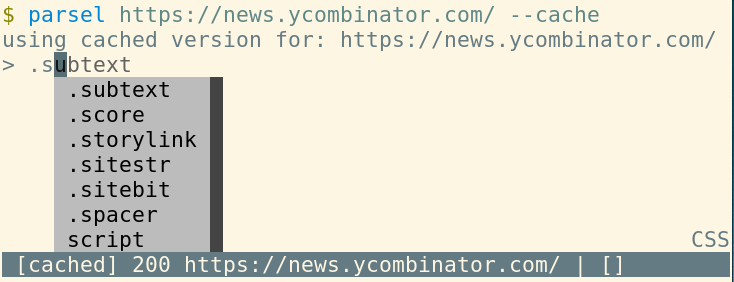

# About parselcli   

  


`parselcli` is a command line interface and interactive shell for [parsel](https://github.com/scrapy/parsel) package for evaluating css and xpath selectors in real time against web urls or local html files.

> Parsel is a library to extract data from HTML and XML using XPath and CSS selectors

Main goal of this tool is to ease document parser development (usually in the context of web-scraping).

## Features:



* Supports `css` and `xpath` selector expressions either.
* [Prompt Toolkit] powered interactive shell with autocomplete, hints, vi mode etc.
* [Playwright] powered browser based rendering
* [Click] powered unix CLI (with pipe support)
* Cache support for repeated usage.
* Extensive and instant text processing via text processor flags.
* User configs `~/.config/parsel.toml`

## Install

Parselcli can be installed through pip:

```
$ pip install --user parsel

# optional: for --browser flag support optional dependency is required:
$ pip install --user "parsel[browser]"

# optional: for better --embed install ipython:
$ pip install --user ipython
```

Note that `--browser` flag is using [Playwright] optional dependency which needs Chromium web browser to work. If `--browser` flag doesn't work ensure the browser is installed via `playwright install chromium` command.


## Example Usage

Calling command `parsel` with any http url will drop terminal into prompt. 
In the prompt css and xpath selector can be entered together with commands and processing options

```
$ parsel "https://github.com/granitosaurus/parsel-cli"

# help command is always there to show available commands and processor flags
> help
Commands:
--help                   print help
--reset                  reset session processors
--embed                  embed repl
--info                   show context info
--css                    switch to css input
--xpath                  switch to xpath input
--open                   open current url in web browser
--view                   open current doc in web browser
--vi                     toggle input to/from vi mode
--fetch                  request new url
Processors:
--first, -1              take only 1st value
--pretty, -p             pretty format html
--slice, -[              take slice
--re                     filter values by regex or if capture groups are present return them
--sum                    sum all values if possible
--repr, -r               represent output (e.g. show newline chars)
--len, -l                return total length
--strip, -s              strip away trailing chars
--absolute, -a           turn relative urls to absolute ones
--collapse, -c           collapse single element lists
--join, -j               join results
--join-with, -J          join results with specified character
-n                       take n-th element

# css selector support
> h1::text
['\n    ', '\n  ', '\n  ', '\n  ', '\n\n  ', '\n', 'About parselcli']

# css selectors with inline processors
> h1::text --join --strip 
About parselcli

# or short form inline processors
> h1::text -js
About parselcli

# or session processors
> --join --strip
active processors: [Join(' '), Strip]
> h1::text
About parselcli

# switching to xpath
> --xpath
switched to xpath
> //h1/text()
About parselcli
```

For usage recipes, see [recipes.md](/recipes.md) documentations.


## Details

```
Usage: parsel [OPTIONS] URL

  Interactive shell for css and xpath selectors

Options:
  -h TEXT                         request headers, e.g. -h "user-agent=cat
                                  bot"
  --xpath                         start in xpath mode instead of css
  --browser                       use browser emulator
  --browser-headless              use headless browser emulator
  --browser-wait [load|domcontentloaded|networkidle|none]
                                  wait for browser page to reach some state
  --browser-wait-css TEXT         wait for browser page to render until css
                                  selector appears
  --browser-wait-xpath TEXT       wait for browser page to render until xpath
                                  selector appears
  -c TEXT                         compile css and return it
  -x TEXT                         compile xpath and return it
  -i TEXT                         initial input
  --cache                         cache requests
  --no-color                      disable html output colors
  --vi-mode                       enable vi-mode for input
  --config TEXT                   config file  [default:
                                  /home/dex/.config/parsel.toml]
  --embed                         start in embedded python shell
  -v                              verbosity level
  --shell [ipython|ptpython|bpython|python]
                                  preferred embedded shell; default auto
                                  resolve in order
  --help                          Show this message and exit.
```

`parselcli` reads XML or HTML file from url or disk and starts interpreter for xpath or css selectors.
By default it starts in css interpreter mode but can be switched to xpath by `-xpath` command and switched back with `-css`.


### Processors and Commands

`parselcli` supports processors and commands in shell for advance usage:

    $ parsel "https://github.com/granitosaurus/parsel-cli"                                                               
    > --help                                                                                                              
    Commands:
    --help                   print help
    --embed                  embed repl
    --info                   show context info
    --css                    switch to css input
    --xpath                  siwtch to xpath input
    --open                   open current url in web browser
    --view                   open current doc in web browser
    --fetch                  request new url
    Processors:
    --first, -1              take only 1st value
    --len, -l                return total length
    --strip, -s              strip away trailing chars
    --absolute, -a           turn relative urls to absolute ones
    --collapse, -c           collapse single element lists
    --join, -j               join results
    --join-with, -J          join results with specified character
    -n  <number>             take n-th element

Commands can be called at any point in the prompter:

    > --fetch "http://some-other-url.com"
    requesting "http://some-other-url.com"
    > --view
    opening document in browser

Processor options can be either activated for specific prompt (inline processors):

    > h1::text --first
    # will take first element

Or can be set for current session (session processors):

    > --first
    default processors: [First]
    # will process every following command with new processors

## Config

`parselcli` can be configured via `toml` configuration file found in `$XDG_HOME/parsel.toml` (usually `~/.config/parsel.toml`):

    # input on parsel launch - usually used to enable session processors
    initial_input = [ "--collapse --strip"]
    # whether input coloring is enabled 
    color = True
    # whether input is in vi mode
    vi_mode = False
    # where prompt toolkit history is located
    history_file_css = "/home/user/.cache/parsel/history_css"
    history_file_xpath = "/home/user/.cache/parsel/history_xpath"
    history_file_embed = "/home/user/.cache/parsel/history_embed"
    
    [requests]
    # when using --cache flag for using cached responses
    cache_expire = 86400
    # where sqlite cache file is stored for cache
    cache_file = "/home/user/.cache/parsel/requests.cache"

    [requests.headers]
    # here headers can be defined for requests to avoid bot detection etc.
    User-Agent = "parselcli web inspector"
    # e.g. chrome on windows use
    # User-Agent = "Mozilla/5.0 (Windows NT 10.0; Win64; x64) AppleWebKit/537.36 (KHTML, like Gecko) Chrome/62.0.3202.94 Safari/537.36"

## Development, Debug and Roadmap

Currently the project is somewhat unstable as I wrote this for myself - minor versions are very likely to break API! 
PRs, suggestions, issues etc. are welcome!

For debugging see `-vv` flag and for info logs see `-v` flag.

 
[Prompt Toolkit]: https://github.com/prompt-toolkit/python-prompt-toolkit
[Click]: https://github.com/pallets/click
[Playwright]: https://github.com/microsoft/playwright-python
